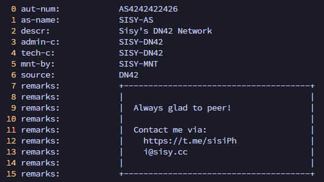

## 前言

一开始听说 BGP 还真不是从大黑书里，而是 MoonWX 玩 DN42 的时候一直给我安利。这下不得不玩一玩了。简单了解下来，DN42 确实是一个很适合学习真正的公网环境是如何运行的[叠加网络](https://zh.wikipedia.org/wiki/覆盖网络)。DN42 趣味在于调试的过程，不过接入这一块基本上也就是按照教程走，顺带在接入过程中学习一些网络知识，除了对等连接 (Peer) 这一步需要费些功夫配置。

本文大量参考了 DN42 的官方文档和一些社区资源，尤其是 [DN42 Wiki](https://dn42.dev/wiki/Main_Page) 和[蓝天大佬的博客文章](https://lantian.pub/article/modify-website/dn42-experimental-network-2020.lantian/)。

## 大致思路

1. 要接入一个网络，首先你需要在网络内有一个“身份”，包含一个 ASN（自治系统编号）、一个 IPv4 地址段（也可包含 IPv6 地址段）、该 ASN 的管理者、能够证明身份的通信凭证（auth key 之类）、联系方式等。
2. 以上身份中的大多数内容是由自己来选择和定义的，但是需要先提交申请，并被批准，整个网络才会认可你的身份。
3. 在 DN42 中，没有真正意义上的“接入点”，你可以在任何地方通过 VPN（如 WireGuard）连接到 DN42 网络中的其他节点来实现接入。这一步即是寻找其他节点并建立对等连接（Peer），需要配置好隧道软件 (VPN) 和 BGP 软件相关的设置。
4. 同时找很多个人 Peer，这可以增加你网络的稳定性，避免某个节点临时故障导致你和 DN42 完全失联。并且，多 Peer 还能够提高其他节点的访问速度，提高网络的冗余性和整体性能。
5. 后续的性能优化和安全配置等。

## 注册

注册的过程其实就是向 DN42 的身份信息 git 仓库提交 PR 的过程，各个信息配置文件的格式和内容都有严格的要求，被批准合并后就算拥有了自己管辖的 ASN 和 IP 地址段之类的了。

1. 首先去 [https://git.dn42.dev](https://git.dn42.dev) 注册一个账户，这是 DN42 通过 Gitea 提供的模板自部署的 DevOps 平台，类似于 GitHub。
2. 所有 DN42 成员的账户信息就存放在仓库 [dn42/registry](https://git.dn42.dev/dn42/registry) 里。为了 PR，先 fork 一份到自己的账户。
3. Clone 已经 fork 的仓库到本地。
4. 接下来就是创建并编辑各个自己所属的配置文件，提交 commit 后创建 PR 了。

需要注意 ASN 和 IP 地址段需要自己挑选空缺的，而且 IPv6 地址极不推荐自己定义地址段前缀，而是通过蓝天大佬提到的随机生成前缀的工具来生成，以符合 RFC4193 中对 IPv6 唯一本地地址的要求。下面列举所有初次注册时必须提交的 8 个文件（注意根据配置不同，可能还需要第 9 个文件 `data/dns/[昵称].dn42`）：

- `data/mntner/[昵称]-MNT`：代表你的账户，用于验证后续操作
- `data/person/[昵称]-DN42`：代表你个人的信息，包含昵称、邮箱等
- `data/aut-num/[你的ASN]`：代表你想申请的 ASN 号，包含 ASN 号、AS 简介、管理者、联系方式等
- `data/inetnum/[地址段前缀]_[地址块大小]`：代表你想申请的 IPv4 地址段，包含地址段前缀、地址块大小、管理者、联系方式等
- `data/route/[地址段前缀]_[地址块大小]`：IPv4 地址段的路由信息，包含地址段前缀、地址块大小、AS 路由（即授权哪个 AS 使用这个地址段）等
- `data/inet6num/[地址段前缀]_[地址块大小]`：代表你想申请的 IPv6 地址段（本文件是可选的，且如果不添加 IPv6 地址段，后续 `data/route6` 中的文件也可以不添加）
- `data/route6/[地址段前缀]_[地址块大小]`：IPv6 地址段的路由信息

各个配置文件的内容和其解释可以直接参考蓝天大佬的博客的[注册过程部分](https://lantian.pub/article/modify-website/dn42-experimental-network-2020.lantian/#注册过程)。描述和原理他已经讲的很清楚了，这里不作赘述。另外，一个好的学习方法是直接参考其他已经成功 merge 的 PR 或参考仓库中已经较为成熟的配置文件来写自己的部分。

这里补充一些蓝天大佬没提到的东西，以及一些需要注意的细节：

1. 提交 commit 所使用的签名密钥必须要包含在 `data/mntner/[昵称]-MNT` 文件中的 `auth` 字段中。该字段的内容是用来验证后续操作的凭证，所以本次 PR 中的 commit 需要使用该密钥进行签名，使自动化验证工具能够确认你的身份拥有对该 ASN 和 IP 地址段的管理权限，并批准你的 PR。
2. 寻找空闲的 IPv4 地址段时，蓝天提到了两个可用的网址，但是 [https://dn42.us/peers/free](https://dn42.us/peers/free) 最后一次更新为 2025 年 10 月末，已经没有什么参考价值了。
3. 对于 IPv4，DN42 一般建议申请的合适的地址块大小为 /27（即包含 32 个地址的块）
4. 对于 IPv6，建议申请 /48 的地址段（即包含 65536 个地址的块）
5. v4 和 v6 的 `inetnum` (`inet6num`) 文件中所配置的 `nserver` 为反向 DNS 服务器，如果配置了，那么还需要在 `data/dns` 目录下添加一个对应的文件，内容包含反向 DNS 服务器的 IP 地址和主机名等信息。
6. 一些文件的 `remarks` 字段可以添加一些比较美观的备注信息，增加一些个性化的内容，当然这不是必须的。以下展示我从 MoonWX 那里抄来的一个示例 `remarks` 字段：



由于蓝天没有提到第 5 点中的这个 DNS 文件，以下简单给出我这个文件的示例内容：

```plaintext
domain:             sisy.dn42
admin-c:            SISY-DN42
tech-c:             SISY-DN42
mnt-by:             SISY-MNT
nserver:            ns1.sisy.dn42 172.23.15.33
nserver:            ns1.sisy.dn42 fd24:ac8e:9e04::1
source:             DN42
```

接下来，创建一个带签名的 commit 并提交 PR。PR 的审核过程可能需要一些时间，审核人员会检查你的配置是否符合要求，并且可能会提出一些修改建议。审核通过后，你的 PR 就会被合并到主分支，你就正式成为 DN42 网络的一员了。

*其实感觉这里面最花时间的还是挑选自己喜欢的 ASN 和 IPv4 地址段，，，*

关于第一个 Peer，暂且先决定放到下一篇里来讲吧。
