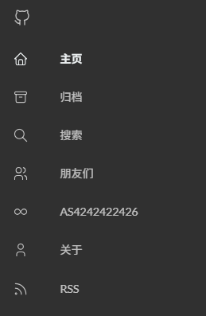
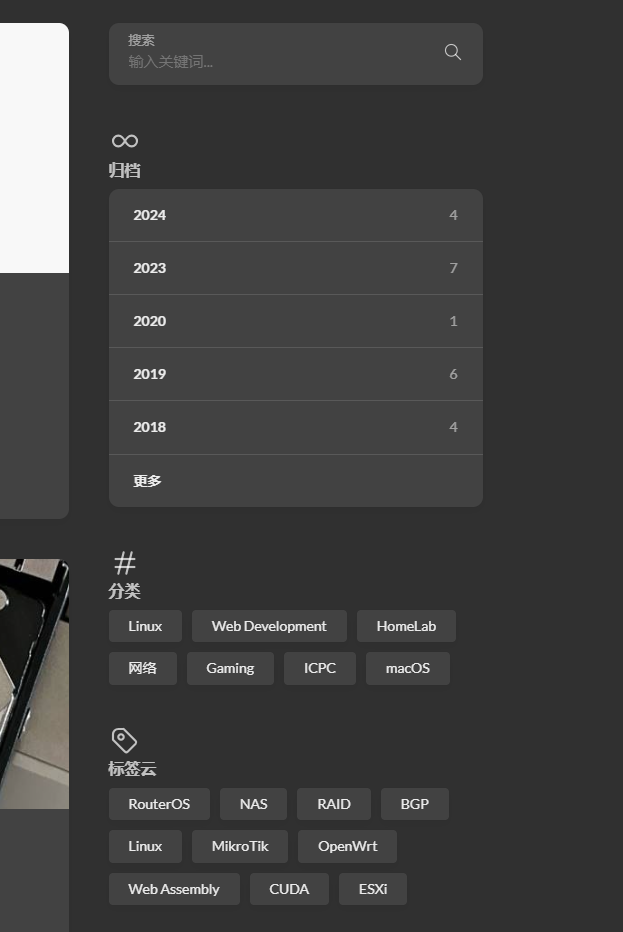

## 前言

我的博客之前用的是 [Astro](https://astro.build/) 的某个主题，但是 Astro 作为博客构建工具的使用体验并不好，因为它本身的设计哲学实际更侧重于为文档站点服务。

前段时间 MoonWX 在 Q 群里分享 [ntzyz](https://ntzyz.space/) 大佬的博客站，感觉大佬这个很简洁干练，不是很花哨，但是又很有技术博客的 feeling，而且并不丑，相反还蛮好看的。（顺带一提这位还是 BGP 大神，之后有空还想 peer 一下）

博客底部标注了由 [Hugo](https://gohugo.io/) 构建，使用 [Hugo Theme Stack](https://github.com/CaiJimmy/hugo-theme-stack) 主题，而且 Hugo Theme Stack 的 Github README 里提供了一个 [starter](https://github.com/CaiJimmy/hugo-theme-stack-starter) 项目，可以作为 template 使用。那么我就直接用这个 starter 来搭建我的博客吧，希望能有个更好的使用体验。

*Stack 主题在 README 中提供了[双语文档](https://stack.cai.im/)，这里不多赘述。*

## 迁移过程

### 托管到 GitHub Pages

首先按照常规操作，想要托管到 GitHub Pages 的话，使用 starter 的 template 来创建新的仓库的时候，需要注意仓库的命名最好为 `<username>.github.io`，这里我就是 `sisypheovo.github.io`，以便于直接被识别为 GitHub Pages 的托管仓库。

创建好仓库之后，在仓库的 `Settings -> Pages` 页面中，将 `Build and deployment` 中的 `Source`选项设置为 `GitHub Actions`，以便自动化部署，毕竟 starter 里已经提供了 GitHub Actions 的 workflow 文件了。

这样就完成了托管，在 [https://sisypheovo.github.io/](https://sisypheovo.github.io/) 就可以直接访问到博客了，只不过内容还全是一些示例和模板，而且侧边栏之类的相比 ntzyz 大佬的博客也差远了.

### 使用自定义域名

常规来讲，要将任何普通内容部署到自己的域名下，最常用的做法肯定还是通过面板，比如 1Panel 之类的。购买并配置域名之后，把编译产物上传到服务器上就行了，然后配一配 DNS 解析、HTTPS 和反向代理等等配置就行了。

但是因为是使用 GitHub Pages 的静态博客，而且域名托管在 Cloudflare，就我知道的而言，有两种方法：

- 用 CNAME 文件配置自定义域名，并在 Cloudflare 中添加 CNAME 记录，指向 `<username>.github.io`，服务器只做 DNS 解析。
- 服务器使用反向代理，将自定义域名的请求转发到 GitHub Pages 的 URL 上。

我个人感觉第一种方法更简单一些，毕竟不需要额外的服务器来做反向代理了，而且有 Github Pages 提供的各种自动化和安全服务，还有免费的 HTTPS 和证书。

第二种就是可以自己做缓存、加速，自定义后端逻辑之类的，还能隐藏真实托管源，但是我也不太需要这些功能，所以就直接用第一种方法了。

首先去到 Cloudflare 的[管理面板](https://dash.cloudflare.com/)，在 `域注册` -> `管理域` 中选择对应的域名（我这里就是 `sisy.cc`），进入到域名的管理页面中，在 `DNS` -> `记录` 选项卡中添加一条 CNAME 记录：

|类型|名称|内容|代理状态|TTL|操作|
|---|---|---|---|---|---|
|CNAME|blog|sisypheovo.github.io|仅 DNS|自动|编辑|

添加完成之后，还是回到仓库的 `Settings -> Pages` 页面中，将 `Build and deployment` 中的 `Custom domain`选项设置为 `blog.sisy.cc`，勾选上 `Enforce HTTPS` 选项，这样就完成了自定义域名的配置，过一段时间之后访问 `blog.sisy.cc` 就可以访问到博客了。

*顺带一提，如果不是用 GitHub Pages，而是自己搭建的服务器，那么配置自定义域名的方式会有所不同，比如需要在编译产物的根目录下放置 CNAME 文件，内容是 `blog.sisy.cc`。*

### 配置

这个主题我说白了用明白还是蛮好用的（等于不好上手吧，额），但是前期配置比较痛苦，因为它各个功能的配置项都比较分散，文档也不全，配置项上的注释也没几个字，很多东西莫名其妙的。

#### 一些普通的配置解读

- `config/_default/markup.toml` 文件中配置了 Markdown 的渲染方式，使用了 Goldmark 这个渲染器，并且启用了各种扩展功能，比如 Latex、表格、脚注、定义列表等等。
- `config/_default/modules.toml`: 这个是 Hugo Modules 的配置文件，里面指定了使用的 Hugo Theme Stack 主题的版本和路径。
- `config/_default/permalinks.toml` 文件中配置了文章的 URL 结构，比如 posts 的 URL 就是 `/posts/:slug/`，也就是 `https://blog.sisy.cc/posts/xxx/` 这样的结构；page 的 URL 就是 `/:slug/`，也就是 `https://blog.sisy.cc/xxx/`。
- `config/_default/related.toml`: 不知道，看不懂，先放着

#### `config.toml`

```toml
baseurl      = "https://blog.sisy.cc/" # 博客的基础 URL，用于生成链接和资源路径
languageCode = "zh" # 博客的默认语言代码，这里设置为中文
title        = "Sisy's Blog" # 博客的标题，会显示在浏览器标签页、页脚的标注、头像下面的标题

# Theme i18n support
# See all available values at https://github.com/CaiJimmy/hugo-theme-stack/tree/master/i18n
defaultContentLanguage = "zh"

# Set hasCJKLanguage to true if DefaultContentLanguage is in [zh ja ko]
# This will make .Summary and .WordCount behave correctly for CJK languages.
hasCJKLanguage = true

# Disqus 评论系统的短名称，在 Disqus 上添加站点的时候会生成一个短名称，用于标识这个站点的评论系统
disqusShortname = "sisypheovo"

[pagination]
    pagerSize = 5
```

#### `_language.toml`

```toml
# Rename this file to languages.toml to enable multilingual support
[zh]
    languageName      = "中文" # 语言名称，会显示在页面左下角的语言切换器中
    languagedirection = "ltr" # 语言的书写方向，ltr 表示从左到右，rtl 表示从右到左
    title             = "Sisy's Blog" # 博客标题，在中文环境下会覆盖掉 config.toml 中的 title 配置
    weight            = 1 # 语言的权重，数值越小优先级越高。

[en]
    languageName      = "English"
    languagedirection = "ltr"
    title             = "Sisy's Blog"
    weight            = 2
```

特别对于权重而言，像这样不是 en 权重最大的话，创建各个博客文章的 index markdown 文件的时候，必须要有 `index.en.md`、`index.zh.md`，而不是 `index.md` 和 `index.zh.md`，否则默认的 `index.md` 文件会被视为 zh 的版本。也要记得跟普通的 i18n 情况不一样，`index.md` 不再是 en 的默认版本了。

另外，对于如上配置，各语言下内容的 URL 结构为 `/xxx/` 和 `/en/xxx/`。

非内容的各个字符串（比如页脚文本）的翻译，可以通过在 `i18n/` 目录下创建对应语言的 TOML 文件来配置，比如 `i18n/zh.toml` 中可以配置中文环境下的各种字符串的翻译。默认部分可以直接从示例仓库的[这里](https://github.com/CaiJimmy/hugo-theme-stack/tree/master/i18n)复制整个文件过来，非常方便。

#### `menu.toml`

```toml
# 像这样在左侧菜单中添加一个不指向任何页面的链接菜单项
# 像这里我就做了一个 RSS 的链接，权重设置为 99，确保它在菜单的最下面显示。不过 icon 需要自己找一找。
# Hugo 的 RSS 订阅链接通常是 `/index.xml`，内容是由 Hugo 自动生成的，不需要手动创建。
[[main]]
    identifier = "rss"
    name = "RSS"
    url = "/index.xml"
    weight = 99

    [main.params]
    icon = "rss"

# 这个很好理解，是显示在头像和简介下方的社交链接，样例也给了两个 icon 状的示范。
[[social]]
    identifier = "github"
    name       = "GitHub"
    url        = "https://github.com/SisypheOvO"

    [social.params]
        icon = "brand-github"
```

关于自定义菜单内容，还可以参考[这篇文档](https://stack.cai.im/zh/config/menu)，除了在 `menu.toml` 文件中配置以 `main` 标识的这种非页面的链接菜单项之外，指向正常页面的菜单项是通过在各个页面（仓库中 `/content/page/` 下的各个内容）各自的 `index.md` 文件前言部分中的 `menu` 字段来配置的。也就是说，各个 page 和每个菜单项是同步创建且一一对应的（除了在 `menu.toml` 中配置的项）。如以下这个简单的配置：

```yml
---
menu:
    main: # 默认是 main 就行
        weight: 4 # 标识这个 page 的排序，需要跨文件管理它们
        params:
            icon: people # 显示在菜单项左边的图标，默认是 svg 格式，放在 `static/icons/` 目录下
---
```

需要注意的是，如果想要添加一些自定义布局的页面，还最好需要额外创建一个 `layouts/` 目录，在里面放置对应的自定义布局 HTML 文件。

以下是一个配置好的菜单示例：



#### `params.toml`

这个文件的配置项就比较多了，内容也比较杂乱，比如博客的主页显示、RSS 输出、favicon、文章排序、页脚信息、日期格式、侧边栏信息、文章信息、页面小部件、社交媒体信息、配色方案等等。关于这里配置的指导，在官方文档的[这个 Config 部分](https://stack.cai.im/zh/config/)解释的还是比较全面的，可以优先参考。

以下我挑一些非常适合新手起步的配置项来讲，其他要么已经解释的很清楚，要么就无需过多调整：

```toml
favicon        = "img/favicon.png" # 显示在浏览器标签页上的图标，写过 web 都懂

# 显示在所有页脚的内容
[footer]
    since      = 2023 # 博客开始运营的年份，最终会显示为 "© 2023 - 2026 博客标题"
    customText = "sisy's blog" # 显示在 since 这一行下方

# 显示在博客右半侧的各种小组件，分为主页显示的和在子页面显示的组件两种
[widgets]
    homepage = [
        { type = "search" },
        { type = "archives", params = { limit = 5 } },
        { type = "categories", params = { limit = 10 } },
        { type = "tag-cloud", params = { limit = 10 } },
    ]
    page = [{ type = "toc" }]

[comments]
    enabled  = true
    provider = "disqus" # 评论系统提供商
```

各个页面是否开启评论也可以通过在对应文件的前言中添加 `comments: false` 来单独控制，是否开启 toc 也是一样的，添加 `toc: false` 就行了。

以下是一个配置好的小组件示例：



### 优化

配置阶段就基本完结了，接下来就可以简单优化一下美观性了，比如我很想要 select 元素原始的下拉箭头，可以在 `assets/scss/custom.scss` 中添加：

```css
.menu-bottom-section #i18n-switch select {
    appearance: auto;
    -webkit-appearance: auto;
}
```

Stack 主题适合用的两个 icon 源：[Tabler](https://tabler.io/icons)、[SVG Repo](https://www.svgrepo.com/).

这一系列流程下来，博客就基本上安定下来，后续唯一的工作就是将旧的文章转移过来，然后写点新东西了。
