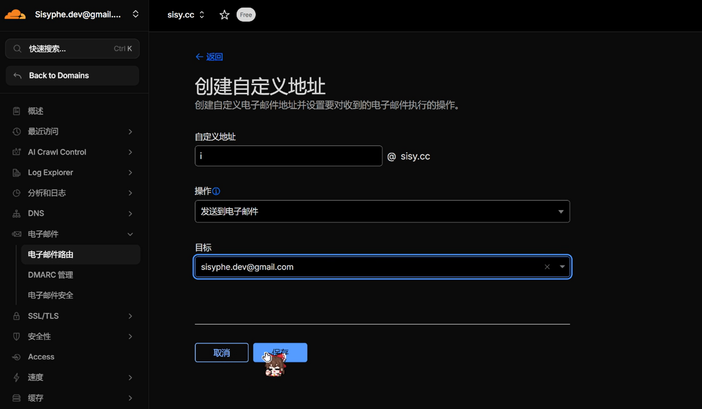
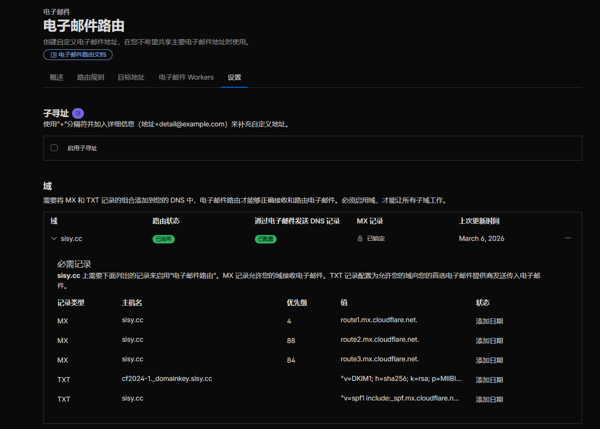
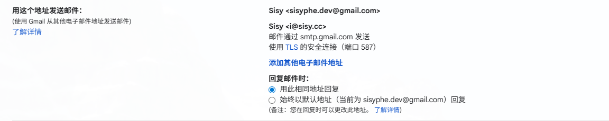
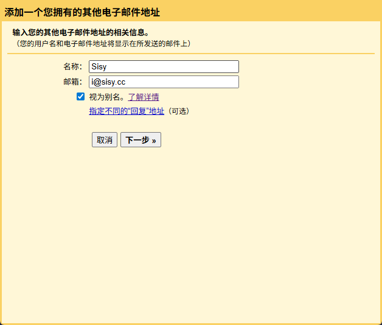
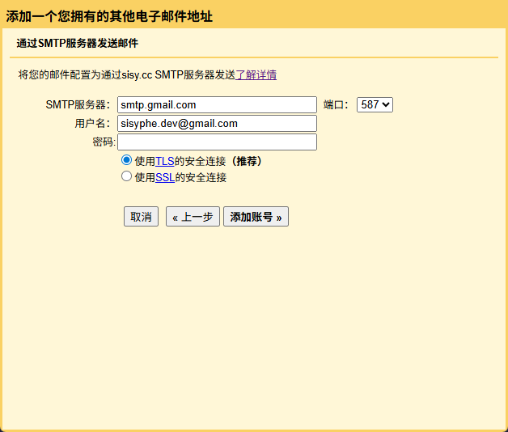
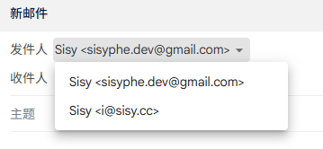

## 前言

前段时间简单玩了一下 Cloudflare 的[管理面板](https://dash.cloudflare.com/)，其中一个 Email Routing 功能能够让用户通过 Cloudflare 的邮件服务器来转发邮件到自己的邮箱里。这一步从操作上实际比较简单，不过可以顺带了解一下邮件转发的原理和一些相关的概念，比如 MX 记录、SPF 记录、DKIM 记录等等。

后续发现在使用自定义邮箱身份的时候，用其他邮箱来发邮件给别人会带来困惑，因为对方无法确定邮件的来源，所以就在想能不能通过自定义域名来代发邮件呢？（话说为什么我一开始没有想到这个问题。。。一个自定义邮件名称的邮箱能收邮件，就一定可以发邮件，还是很自然的）

于是陆续把正反向邮件转发都搭建了一下。

## 自定义域名代收



在 Cloudflare 面板的 `域注册` -> `管理域` 中选择对应的域名（我这里就是 `sisy.cc`），进入到域名的管理页面中，在左侧选择 `电子邮件` -> `电子邮件路由` 选项卡。这个页面如果没用过的话先点击开始使用，进入真正管理电子邮件路由的页面。

进入 `路由规则`，在 `自定义地址` 版块中点击 `创建地址`，输入自定义地址（比如以 `i@sisy.cc` 代表本人），操作这一栏选择 `发送到电子邮件`（另一个选项 `发送到 Worker` 是用于将邮件发送到 Cloudflare Worker，以实现复杂邮件处理逻辑的），目标填写自己的 Gmail 邮箱地址，点击保存。这将会创建一个新的邮件转发规则：

|自定义地址|操作|目标|状态|
|-|-|-|-|
|[i@sisy.cc](i@sisy.cc)|发送到电子邮件|[sisyphe.dev@gmail.com](sisyphe.dev@gmail.com)|活动|

这样一来，他人向 [i@sisy.cc](i@sisy.cc) 发送邮件时，邮件将会被转发到 [sisyphe.dev@gmail.com](sisyphe.dev@gmail.com)。这一步的本质是，创建邮件转发规则后，Cloudflare 会自动生成一些 DNS 记录来支持邮件转发功能，包括 MX 记录、TXT 记录 (SPF 记录、DKIM 记录) 等。如下图中，可以看到 Cloudflare 已经自动添加了三条 MX 记录和两条 TXT 记录：



三条 MX 记录分别指向 `route1.mx.cloudflare.net.`、`route2.mx.cloudflare.net.` 和 `route3.mx.cloudflare.net.`，优先级分别为 4、88 和 84。这些 MX 记录告诉其他邮件服务器，当有人向 [i@sisy.cc](i@sisy.cc) 发送邮件时，邮件将会被转发到 [sisyphe.dev@gmail.com](sisyphe.dev@gmail.com)。而两条 TXT 记录则分别是 SPF 记录和 DKIM 记录，用于验证邮件的真实性，防止邮件被伪造或被标记为垃圾邮件。

## 自定义域名代发

*简易的说明教程，可以看 [Gmail 帮助：通过其他地址或别名发送电子邮件](https://support.google.com/mail/answer/22370?authuser=0)*

邮件代发的原理是，在发送邮件时，使用自定义域名作为发件人地址，并通过某个邮件服务器（比如 Cloudflare 的邮件服务器）来发送邮件。这样一来，收件人就能够看到邮件是从自定义域名发送的，而不是 Gmail 的地址。事实上 Cloudflare 也确实提供了邮件发送功能，只不过要氪金，所以还是从 Gmail 这一边来下手吧。

### 添加发送地址



在 Gmail 设置页面中，进入 `账户和导入` 选项卡，找到 "发送邮件地址" 版块（如上图），点击"添加其他电子邮件地址"。这将会呼出一个弹窗。



在弹出的窗口中，输入计划用来代发的自定义邮件地址（比如 [i@sisy.cc](i@sisy.cc) ），以及显示名称（比如 Sisy）。点击下一步，进入 SMTP 服务器设置页面。



这里 SMTP 服务器地址默认会被识别为 Cloudflare 的收件地址 `route1.mx.cloudflare.net`，端口 587，但是 Cloudflare Email Routing 只负责收件，它不提供 SMTP 发件服务。`route1.mx.cloudflare.net` 是它的接收邮件服务器（MX），不是发件服务器（SMTP）。所以需要改为 Gmail 的 SMTP 服务器地址，例如 `smtp.gmail.com` 或 `smtp.your-school.edu`，端口还是填 587（TLS 加密发件的标准端口）。

为什么希望用自定义域名代发邮件，这里却要填 Gmail 的 SMTP 服务器地址？这里的核心逻辑是：Gmail 本身不提供“直接用外部域名发信”的 SMTP 服务。当想用自定义域名发邮件时，Gmail 的机制是：

- 由 Gmail 的服务器（smtp.gmail.com）实际执行发件操作
- 但在邮件头里，把“发件人”声明为 `i@sisy.cc`

这里我就拿 `smtp.gmail.com` 来管理。用户名和密码则是 Gmail 的账户名和密码，用以验证发件身份，证明这个发件请求确实是由本人授权的。输入完成后点击 `添加账号`。

Tips: 这里很容易遇到问题，尤其是 Google 账号开启了两步验证的情况下。提示类似于：

```plaintext
身份验证错误。请检查您的用户名和密码。
服务器返回错误: "535-5.7.8 Username and Password not accepted. For more information, go to 535 5.7.8 https://support.google.com/mail/?p=BadCredentials 46e7d38a34.3 - gsmtp , code: 535"。
```

即登录凭据被拒。这时候需要用到一个叫做 "应用专用密码" 的东西。Google 账号的安全设置里有一个 "应用专用密码" 的选项，可以生成一个专门用于第三方应用（比如 Gmail SMTP，额，为什么这算第三方应用）的密码。生成后把这个密码填到上面的密码输入框里，就可以成功验证了。点击[这个链接](https://myaccount.google.com/apppasswords)来生成应用专用密码。

### 验证地址

添加账号之后，Gmail 会向目标自定义邮箱地址（我这里就是 [i@sisy.cc](i@sisy.cc)）发送一封验证邮件。因为之前已经设置了邮件转发，所以这封验证邮件会直接被转发到 Gmail 的收件箱里，这样就又回到了 Gmail。打开这封邮件，点击里面的验证链接，完成验证过程就行。这样一来，就成功把自定义域名添加为 Gmail 的一个发件地址了。之后通过 Gmail 发送邮件时，可以在发件人地址处选择 Gmail 地址或者自定义域名地址两种。


