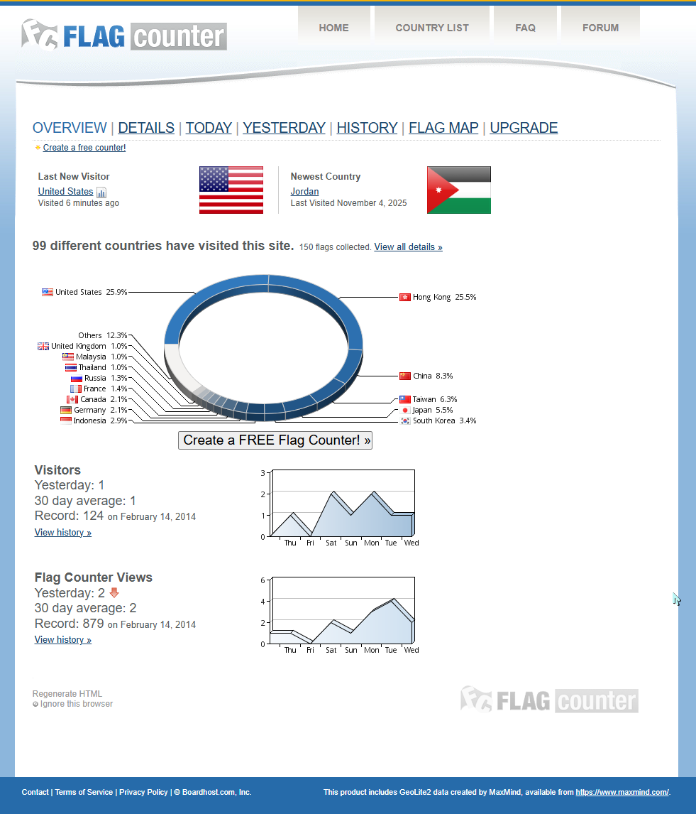
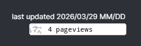
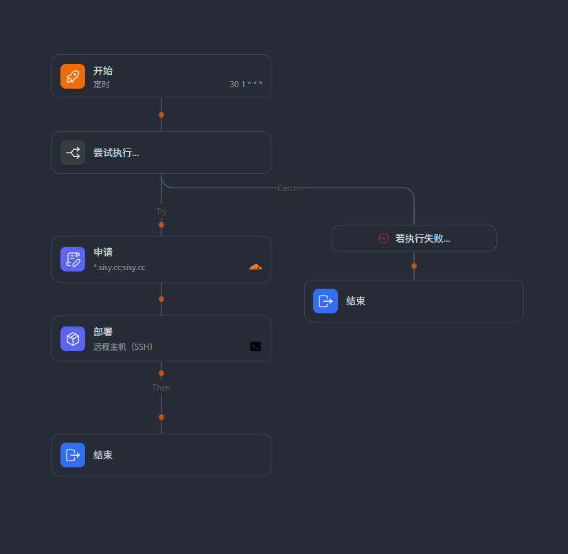
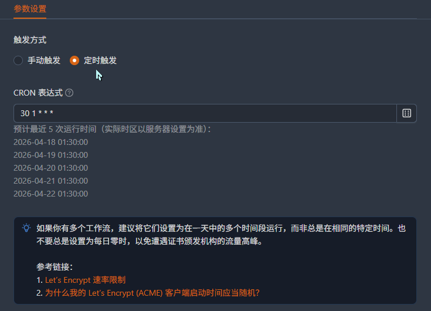
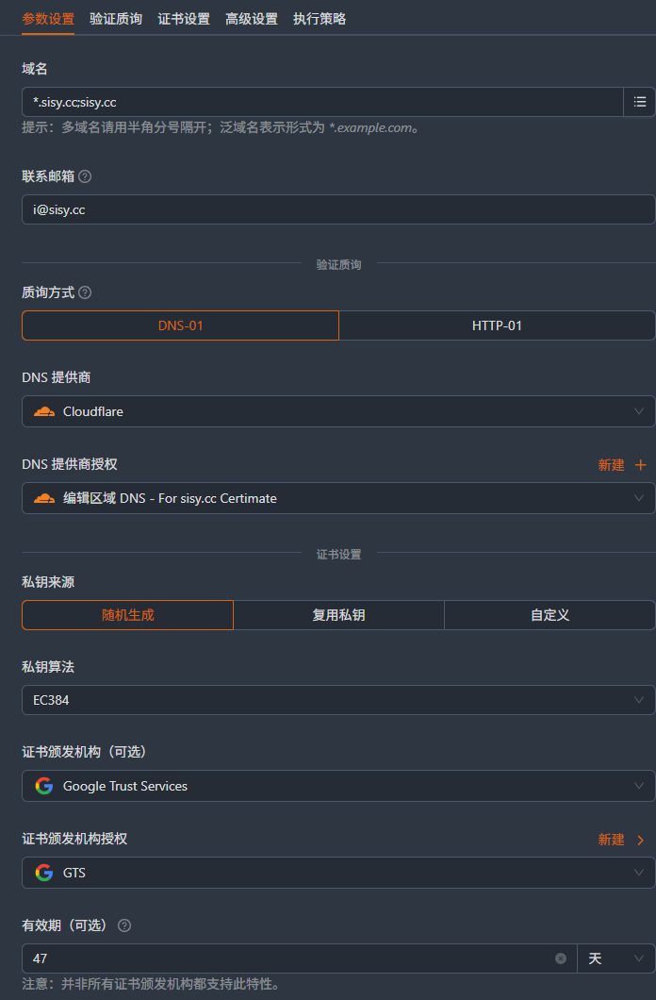
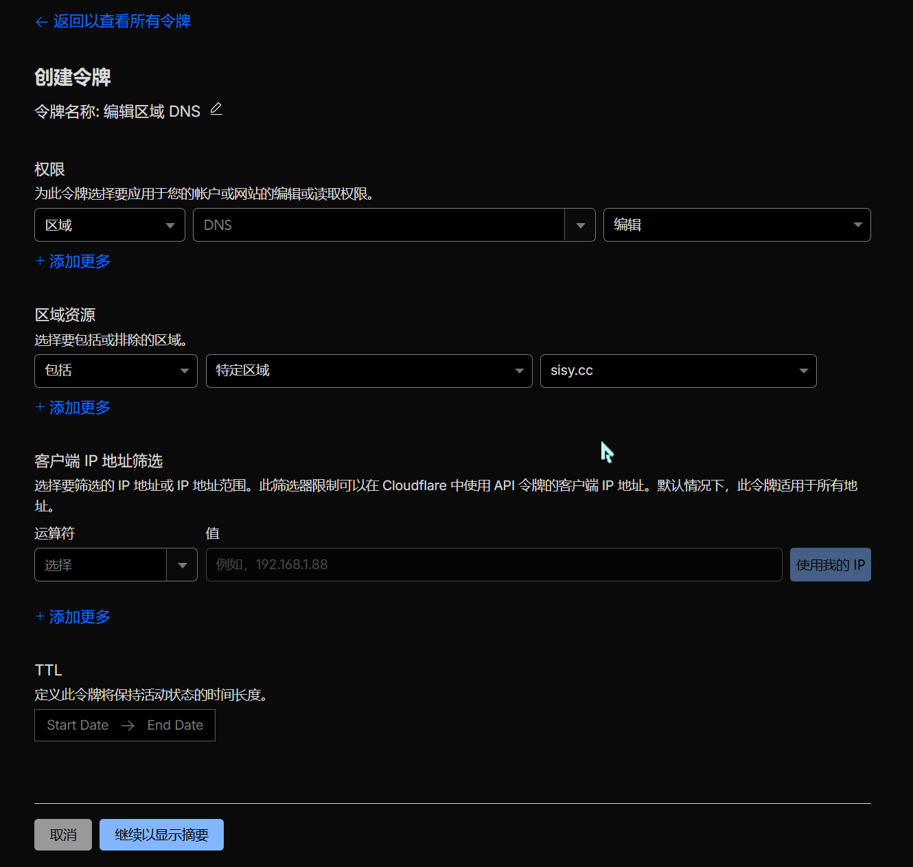
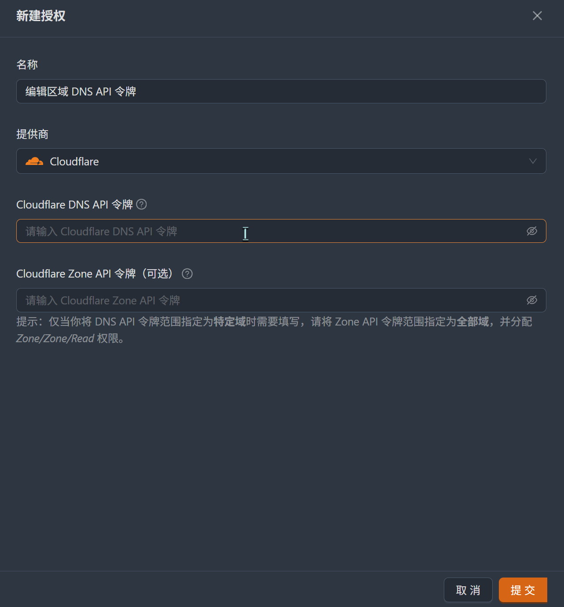
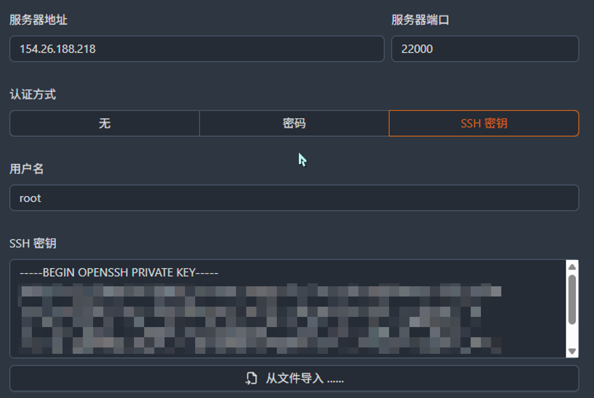

## 前言

起因是看到 osu! 玩家 [IamKwaN](https://osu.ppy.sh/users/1856463) 的 profile 上有一个很像 shields.io 风格的访问计数器，让我想起非常多人都喜欢在自己的博客或者 GitHub Profile 上挂一个类似的 hit counter 来统计访问量。


他这个计数器点击之后会跳转到一个 `bit.ly` 托管的短链接（估计是为了隐藏真实链接防止屏蔽之类的），最终重定向落在一个叫 [Flag Counter](https://s05.flagcounter.com/more/T31K/) 的服务上，显示他这个 profile 关于访问次数和访客所属地区分布的详细信息。



我还是蛮喜欢这个小巧的 mini counter 的，比起他们普通的 flag counter 要美观很多。这个服务免费、很完善，且似乎自带一定的流量控制，短时间内重复访问不会多次计数————美中不足之处就是这个服务不是开源的（）。于是我就自己注册账号生成了一个唯一链接，结果又发现一个头疼的问题：



访问次数很少的时候，这个图片的长度居然与访问次数 6 位数时看起来差不多长！这样右边就有一坨空白，而且官方给的 url 链接配置参数里也没有什么能控制图片宽度的选项，感觉有点逆天。。。

于是我试图找到类似的 website hit counter 的开源替代品，结果回想起来很多 booru 站点甚至包括 Steam，都有类似 n 个二次元人物手举数字牌子的访问计数器，最后终于找到了 [Moe-Counter](https://github.com/journey-ad/Moe-Counter) 这个项目（没想到居然是国人写的项目）。

[Moe-Counter](https://github.com/journey-ad/Moe-Counter) 是一个支持多种主题的萌萌计数器，支持直接用他们自己的服务器和已部署到公网的 WebUI 生成一个唯一 id 的链接来用，另外 README 里也写了本身支持 Docker 部署。

看起来搭建不算复杂，但当我真正想把它跑在自己的服务器上、对公网开放访问、挂上自定义域名、提供 HTTPS 安全连接的时候，才发现从"能跑"到"能用"之间还有不少坑要踩。不过正好能顺便学一下用 Nginx 反代一个服务，以及用 Certimate 来自动化管理 HTTPS 证书，另外似乎还有一些 Cloudflare DNS 配置的细节也需要注意，还能练练 Docker compose ———— 嗯嗯。。。不错的实践机会。

那么下面就开始吧！

## 预备步骤

先拉下来熟悉一下结构。

```bash
git clone https://github.com/journey-ad/Moe-Counter.git
cd Moe-Counter
ll
```

### 项目结构

项目结构比较清晰，几个关键目录和文件：

|路径|用途|
|-|-|
|`views/`|页面模板（Pug），首页展示逻辑在这里|
|`assets/`|静态资源，包括各种主题的数字图片|
|`utils/`|工具函数，主题加载逻辑|
|`db/`|数据库适配层（SQLite / MongoDB）|
|`index.js`|入口文件，路由定义|
|`.env.example`|环境变量配置模板|
|`Dockerfile`|Docker 构建文件|
|`docker-compose.yml`|Docker Compose 配置|

看样子还能自己加主题，只要在 `assets/` 里放一套 1-9 的数字图片，然后在 `views/index.pug` 里加个选项提供到 WebUI 首页上就行了。

现代的 Docker Compose 已经（详见[这篇](https://docs.docker.com/compose/intro/compose-application-model/#the-compose-file)和[这篇](https://docs.docker.com/reference/compose-file/)）

- 弃用了 `docker-compose.yml` 文件名，改使用 `compose.yaml`
- compose 文件中也不推荐再使用 `version` 字段了，直接写服务定义就行了

不过这个项目里还是用的一些旧标准，不过也不影响使用————虽然我还是把这两个都改掉了。

### 配置一下

env 先复制一份：

```bash
cp .env.example .env
```

`.env` 文件的主要配置项：

```ini
# 这个 URL 是给生成的访问计数器图片链接用的，必须是公网可访问的 URL
# WebUI 中的各个示例计数器图片也都是基于这个 URL 拼接的
# 后面会用到 Cloudflare 反代，所以这里直接填最终访问的 URL 就行了
APP_SITE=https://moe.sisy.cc

APP_PORT=3000
DB_TYPE=sqlite
DB_INTERVAL=60
LOG_LEVEL=debug
```

它还支持 MongoDB，不过如果只是个人用，感觉 SQLite 完全够了。

因为我考虑后续需要编辑项目内容（增加访问次数去重逻辑、添加自定义主题之类的），所以不能直接 `docker pull` 官方镜像，而是要从源码本地构建。另外，他这个 `docker-compose.yml` 的内容本来也唐完，因此 `compose.yaml` 也得改，先看看原先的 `docker-compose.yml`：

```yaml
version: '3' # 已经不推荐写 version 了
services:
  moe-counter:
    build: . # 得加一条 image 指定构建目标是本地镜像
    ports:
      - "3000:3000"
    volumes:
      - ./data:/app/data
    environment: # 额，首先这不优雅，其次你不是有 .env 文件了么
      - APP_PORT=3000
      - DB_TYPE=sqlite
```

改成下面这样：

```yaml
services:
  moe-counter:
    build: .
    image: moe-counter:local
    container_name: moe-counter
    ports:
      - "3000:3000" # 注意这里，后面用 Nginx 反代后会更优雅一些
    volumes:
      - ./data:/app/data
    env_file:
      - .env
    restart: unless-stopped
```

这样就差不多能起了。

## 实现公网可达

```bash
docker compose up -d
docker logs -f moe-counter # 也可以不看日志，这个服务比较简单。
curl -I http://localhost:3000 # 应该返回 HTTP/1.1 200 OK
curl http://localhost:3000 # 或者用 Termius 的 Port Forwarding 直接在浏览器看效果也行
```

此时不仅能在 VPS 本地 curl 访问，而且其实已经可以成功从远端使用 `http://<服务器 IP>:3000` 访问到 WebUI 了，只不过还没有域名和 HTTPS，比较丑陋。

而且直接用 3000 端口将服务暴露出去也不太漂亮，后面用 Nginx 反代一下，把 80/443 的流量转到 3000，这样就能在单端口开多个服务，非常优雅。

不过在 Nginx 配置之前，先把这个服务的 3000 端口绑定在回环地址上，这样外网就无法直接访问了，所有流量都得走 Nginx 反代进来，也更安全。调整一下 compose 配置：

```yaml
services:
  moe-counter:
    ports:
      - "127.0.0.1:3000:3000"
```

依旧验证：

```bash
curl -I http://127.0.0.1:3000 # return HTTP/1.1 200 OK
```

## 实现域名解析

既然已经能从公网访问了，下一步就是把域名指过来。

### Cloudflare DNS 配置

DNS 服务用的是 Cloudflare，所以在 Cloudflare 里添加一条 A 记录：

|类型|名称|内容|代理状态|
|-|-|-|-|
|A|moe|114.514.91.69|仅 DNS|

访问 `http://moe.sisy.cc`，发现无法连接。这时反应过来浏览器访问域名时默认连的是 80 端口，而我的服务跑在 3000。自建服务跑在非标端口时，中间必须有一层反代来转发流量。

不过 Cloudflare DNS 侧已经无需再动，接下来把 Nginx 反代调通就完成域名解析了。

### Nginx 反代

解决端口问题的标准做法是用 Nginx 做反向代理：浏览器访问 80/443 → Nginx 接住 → 转发到本地 3000 → Moe-Counter 处理 → 原路返回。由于暂时没有证书，我们的思路就是先监听 80，确认反代没问题后再配置证书，然后把 Nginx 配置也同步升级到 443 与 HTTPS 支持。

先安装一下：

```bash
sudo apt update && sudo apt install -y nginx
```

新建 `/etc/nginx/sites-available/moe-counter` 来放本站的 Nginx 配置：

```nginx
server {
    listen 80;
    server_name moe.sisy.cc;

    location / {
        proxy_pass http://127.0.0.1:3000;
        proxy_http_version 1.1;
        proxy_set_header Host $host;
        proxy_set_header X-Real-IP $remote_addr;
        proxy_set_header X-Forwarded-For $proxy_add_x_forwarded_for;
        proxy_set_header X-Forwarded-Proto $scheme;
        proxy_set_header Upgrade $http_upgrade;
        proxy_set_header Connection "upgrade";
    }
}
```

启用并重载：

```bash
sudo ln -s /etc/nginx/sites-available/moe-counter /etc/nginx/sites-enabled/
sudo nginx -t # 测试配置正确
sudo systemctl reload nginx # 热重载新配置
```

此时浏览器访问 `http://moe.sisy.cc` 就能返回 WebUI了，HTTP 就通了，接着往下做 HTTPS。

## HTTPS: 证书与 ACME 自动化



HTTPS 这一步，感觉真是懒得渐进式优化了，直接上 ACME 自动化证书维护吧。横向对比了一圈，最终还是决定使用 [Certimate](https://github.com/usual2970/certimate) 来管理证书。瞧瞧这优雅的工作流！（虽然我由于时间原因把工作流中的错误处理节点删了，等后续有机会再加回来吧）

### 为什么不用 Certbot？

Certbot 是最常用的 Let's Encrypt 客户端，单机单域名场景下非常省事——一条命令就能申请证书并自动改写 Nginx 配置。但我选择了 [Certimate](https://github.com/usual2970/certimate)，主要出于几个考虑：

- **DNS-01 验证**：HTTP-01 验证需要 CA 直接访问 80 端口，而且没法签发通配符证书。DNS-01 只需要在 DNS 里加一条 TXT 记录，完全不走 HTTP 流量，还支持通配符证书。并且 Certimate 对 Cloudflare 的 DNS API 支持得很好，能自动增删改查 TXT 记录。
- **集中管理**：其他域名、服务器需要证书，Certimate 可以统一管理，不需要每台机器都装一遍 Certbot。
- **Web 面板**：比起 Certbot 的命令行，有个面板看着更直观，工作流的触发记录、证书状态一目了然。
- **定时任务**：据可靠消息，Certimate 的定时任务应该比 Certbot 的更可靠一些。

当然 Certbot 本身完全够用，如果你只有一个域名、一台服务器，用 Certbot 反而更简单。

### 部署 Certimate

Certimate 本身也是一个 Web 应用，为优雅性，自然是用 Docker 跑。因为它能 SSH 你的服务器、调用 Cloudflare API 改 DNS，权限很大，并且 README 里提供了初始 Admin 账户的邮箱和密码，所以**绝对不能把管理面板暴露到公网**，否则被攻击就惨了。

先拉一下 Docker Compose。注意最好不要用官网的一键起容器的脚本，因为它会把面板暴露在 8090 端口上，直接暴露在公网是非常危险的。我们要改成只绑定在回环地址上，需要拉下来之后先改 compose 文件，这样外网就无法访问了，所有流量都得走 SSH 隧道进来。

```bash
mkdir -p ~/certimate && \
cd ~/certimate && \
curl -O https://raw.githubusercontent.com/certimate-go/certimate/refs/heads/main/docker/docker-compose.yml

mv docker-compose.yml compose.yaml
vim compose.yaml
```

改一下回环和版本号，其他默认：

```yaml
# version: "3.0" 不要这个
services:
  certimate:
    image: certimate/certimate:latest
    container_name: certimate
    ports:
      #  - 8090:8090 不要这个
      - "127.0.0.1:8090:8090"
    volumes:
      - /etc/localtime:/etc/localtime:ro
      - /etc/timezone:/etc/timezone:ro
      - ./data:/app/pb_data
    restart: unless-stopped
```

这里 `-p 127.0.0.1:8090:8090` 保证面板只能从服务器本机访问。管理时，通过 SSH 端口转发就行了。保存之后直接起面板：

```bash
docker compose up -d
docker logs -f certimate
curl -I http://127.0.0.1:8090
```

我用的访问终端是 Termius，在 Port Forwarding 里加一条 Local 规则：

|字段|值|
|-|-|
|Label|Certimate|
|Local Port number|8090|
|Local address|127.0.0.1|
|Intermediate Host|Host Name|
|Destination Host|127.0.0.1|
|Destination Port|8090|

保持 SSH 连接后，在本地浏览器打开 `http://127.0.0.1:8090` 就能进入 Certimate 面板。断开 SSH 后面板自动不可达，安全性拉满。

### 熟悉一下 Certimate 面板

进来之后第一件事当然是先改掉默认的 Admin 账户和密码了。设置里还有一些全局的 ACME 配置项，基本不太需要动，之后写新的工作流的时候，直接细调工作流内局部的配置就行。

Certimate 的核心功能是**工作流**，它把申请证书、部署证书、续期检查这些操作都抽象成一个个节点，然后串成一个流程。我们的思路就是写一个工作流来实现以下流程的自动化：

```plaintext
申请证书 → 部署到 Nginx → 定时续期 (→ 检查和续签时发现错误 → 告警)
```

至于其他页面，都可以视为工作流涉及的其他附属内容了。比如证书页面能看到每个证书的详细信息和状态，仪表盘页面能看到每次工作流执行的日志，授权凭证页面能看到工作流中涉及的各种第三方服务的授权信息（Cloudflare API Token、SSH 密钥之类的），等等。

### 工作流各节点配置

先从一个默认模板开始就好。

#### 开始节点



工作流的触发方式有分手动和自动，那显然是自动啊！所以选一下定时触发。Certimate 的定时任务使用 Cron 表达式，先设置成 `30 1 * * *`，每天凌晨 1:30 执行一次。至于为什么每天走一遍工作流，可以看下面的 [TLS 续期策略](#tls-续期策略) 部分。

#### 申请节点



首先配置证书颁发给哪些域：这里除了用通配符 `*.sisy.cc` 之外，别忘了要加上根域 `sisy.cc`。

##### 验证质询

由于 HTTP-01 质询需要 CA 直接访问 80 端口，而且不支持通配符证书，所以质询方式一般选 DNS-01，配合 Cloudflare API 来自动添加 TXT 记录。因此 DNS 提供商选 Cloudflare。

此时还需要添加一个 Cloudflare 颁发的 API Token 来授权 Certimate 通过这个 API Token 修改 Cloudflare 上的 DNS 记录。

###### 配置 Cloudflare API Token

_主要还是参考这一篇文章：[Cloudflare Fundamentals - Create API token](https://developers.cloudflare.com/fundamentals/api/get-started/create-token/)_

在 [Cloudflare → My Profile → API Tokens → Create Token](https://dash.cloudflare.com/profile/api-tokens) 里用 "Edit zone DNS" 模板创建：



权限保持默认的 `Edit` 权限，因为我们需要 Certimate 自动增删改查 TXT 记录来完成 DNS-01 验证。唯一需要改的就是 `Zone Resources`，选择 `Specific zone` 并且只选 `sisy.cc` 这个域，而不是 `All zones`，否则一旦 Token 泄露了，攻击者就能更改 Cloudflare 账号下所有域名的 DNS 记录。最小权限原则是几乎零成本的安全加固。

不过客户端 IP 地址筛选可以不动他，限制一台部署 Certimate 的主机访问的确可以，但没什么必要。TTL 也不需要额外修改，此时点击 `继续以显示摘要` 按钮，确认权限和资源范围都正确后，点击 `创建令牌`，就能拿到这个 API Token 的值了。把它复制下来，填到 Certimate 的授权凭证里：



##### 证书设置

Certimate 的证书设置里有几个参数需要选择，简单说一下每个怎么填：

**私钥来源 → 随机生成**。每次续期都生成新的私钥，万一某一代私钥泄露，影响范围更小，具有向前安全性。"复用私钥"是给 HPKP（已废弃）和 DANE/TLSA 这类特殊场景用的，普通网站不需要。

>_**注意，以下颁发机构均使用 Google Trust Services，情欲先了解ACME EAB 账号获取的相关信息，难以完成则使用 Let's Encrypt 即可。**_

**颁发机构 → Google Trust Services**。具体原因依旧可以看下面的 [TLS 续期策略](#tls-续期策略) 部分。

**颁发机构授权**：这个由于我们用的是 Google Trust Services，所以需要一个 ACME EAB 账号，拿到这个授权的 ID 和 Key 后把它们填到申请节点的对应字段里。关于如何获取，请参考 [使用 Public CA 和 ACME 客户端请求证书](https://cloud.google.com/certificate-manager/docs/public-ca-tutorial)。

**有效期 → 47 天**。具体原因依旧可以看下面的 [TLS 续期策略](#tls-续期策略) 部分。

**首选链 → 留空/默认**。以前有人为了兼容老旧 Android 手动选链到 DST Root CA X3，但那条链 2024 年 9 月已经过期了，现在默认的 ISRG Root X1 兼容所有主流设备。

**ACME 配置文件 → classic（默认）**。classic 对应长有效期的传统证书。另一个选项 `shortlived` 是 7 天有效期的超短期证书，对自动化系统稳定性要求极高，个人项目没必要用。

**阻止 CSR 包含主题通用名称 → 不勾选**。这个选项会禁止在 CSR 里包含通配符证书的通用名称（CN），只把域名放在 Subject Alternative Name (SAN) 里。这个选项是为了兼容一些老旧 CA 的奇葩要求的，现代 CA 都没问题，所以不选。

##### 重复申请

设置为当上次申请证书成功后、且证书剩余有效期大于 17 天，再次运行工作流时跳过此申请节点。具体原因依旧可以看下面的 [TLS 续期策略](#tls-续期策略) 部分。

#### 踩坑：容器文件隔离

起初以为“部署节点”部分不怎么需要动，结果Certimate 第一次执行工作流后，虽然面板提示证书签发成功，路径是 `/etc/ssl/certimate/cert.crt` 和 `/etc/ssl/certimate/cert.key`，但是我直接在 Nginx 配置里填这两个路径，`nginx -t` 直接报错：

```plaintext
cannot load certificate "/etc/ssl/certimate/cert.crt": BIO_new_file() failed
(SSL: error:80000002:system library::No such file or directory)
```

排查了一下，发现问题是，事实上证书写在了 Certimate 容器内部的文件系统里，宿主机根本看不到。Docker 容器的文件系统和宿主机是完全隔离的，除非做了 `volumes` 挂载，否则两边的 `/etc/ssl/certimate/` 是两个毫无关系的目录。然而即使挂载到宿主机，每次重新申请证书后，也无法触发宿主机上的 Nginx 重新加载，这样就需要在 Certimate 中配置一个 Webhook，还需要自己写一个脚本来监听这个 Webhook，收到通知后再执行 `nginx -t && systemctl reload nginx`，感觉极其麻烦。（理论上应该可以通过“部署后事件”来解决）

**解决方案**：在 Certimate 的工作流里改用 **SSH 部署**节点，让 Certimate 通过 SSH 把证书从容器内部推送到宿主机的真实路径。操作步骤：

1. 在宿主机上生成一对 SSH 密钥：

    ```bash
    ssh-keygen -t ed25519 -f ~/.ssh/certimate_deploy -N "" -C "certimate-deploy"
    cat ~/.ssh/certimate_deploy.pub >> ~/.ssh/authorized_keys
    cat ~/.ssh/certimate_deploy # 用于填充到 Certimate 面板里
    ```

2. Certimate 部署节点中，部署目标选择 SSH
3. 主机提供商授权中输入服务器 IP、端口、用户，以及上一步生成的 SSH 私钥内容。

    

4. 证书和证书密钥的输出路径还填 `/etc/ssl/certimate/cert.crt` 和 `/etc/ssl/certimate/cert.key`。

再次执行工作流，这次证书成功落到宿主机的目录下，Nginx 终于能读到了。

### 升级 Nginx 配置为 HTTPS

证书到位后，把 Nginx 配置升级为 HTTPS:

```nginx
# Redirect HTTP to HTTPS
server {
  listen 80;
  server_name moe.sisy.cc;
  return 301 https://$host$request_uri;
  }

  # HTTPS main service
  server {
    listen 443 ssl http2;
    server_name moe.sisy.cc;

    ssl_certificate     /etc/ssl/certimate/cert.crt;
    ssl_certificate_key /etc/ssl/certimate/cert.key;

    # Recommended SSL params
    ssl_protocols TLSv1.2 TLSv1.3;
    ssl_ciphers ECDHE-ECDSA-AES128-GCM-SHA256:ECDHE-RSA-AES128-GCM-SHA256:ECDHE-ECDSA-AES256-GCM-SHA384:ECDHE-RSA-AES256-GCM-SHA384;
    ssl_prefer_server_ciphers off;
    ssl_session_cache shared:SSL:10m;
    ssl_session_timeout 1d;

    location / {
        proxy_pass http://127.0.0.1:3000;
        proxy_http_version 1.1;
        proxy_set_header Host $host;
        proxy_set_header X-Real-IP $remote_addr;
        proxy_set_header X-Forwarded-For $proxy_add_x_forwarded_for;
        proxy_set_header X-Forwarded-Proto $scheme;
        proxy_set_header Upgrade $http_upgrade;
        proxy_set_header Connection "upgrade";
    }
}
```

测试并重载：

```bash
sudo nginx -t
sudo systemctl reload nginx
```

访问 `https://moe.sisy.cc`，浏览器里的证书锁和证书详情应该都会出现，这样 HTTPS 就大功告成了！

## TLS 续期策略

我申请到的证书有效期是 47 天，截至我写这篇博客的时候，只有 Google Trust Services 一家提供了 47 天有效期的证书。秒选啊秒选。

关于为什么现代网络正在推行 90 -> 47 天的更短期证书，可以参考 [CA/Browser Forum 上投票决定的结果](https://cabforum.org/working-groups/server/baseline-requirements/requirements/#632-certificate-operational-periods-and-key-pair-usage-periods) ，在这之前提出并推动此事的[这篇文章](https://groups.google.com/a/groups.cabforum.org/g/servercert-wg/c/bvWh5RN6tYI)，以及[这篇分享此事的博客](https://www.bleepingcomputer.com/news/security/ssl-tls-certificate-lifespans-reduced-to-47-days-by-2029/)。

简单来说，2025 年早些时候，Apple 公司提出了一项缩短证书有效期的动议，该动议得到了 Sectigo、Google Chrome 团队和 Mozilla 的支持。该提案将在未来四年内逐步缩短证书的有效期，从截至 2025 年的 398 天需求，在 2029 年 3 月之前缩短到 47 天需求。这个提案的目标是最大限度地降低因证书数据过期、加密算法过时以及长期暴露于泄露凭证而带来的风险。此外，它还鼓励企业和开发者利用自动化手段来更新和轮换 TLS 证书，从而降低网站运行在过期证书上的可能性。

我的证书工作流的时间策略为：

|参数|值|
|-|-|
|工作流触发频率|每天 1 次|
|提前续期阈值|15 天|

"每天触发"听起来很频繁，但 Certimate 会先检查证书的剩余有效期，没到阈值就跳过，不会真给 CA 发请求。这样设置的好处是

- 失败后有足够的重试窗口——如果某次续期因为网络抖动失败了，明天还会再试。设 15 天阈值意味着有 15 次重试机会。
- 失败后证书还有足够的剩余有效期，可以有充足的时间手动介入修复问题，不至于证书过期了才发现。

如果把触发频率设成 30 天，万一到了续期的那一次恰好失败，下一次触发时证书已经过期了——47 天的证书根本扛不住 30 天的触发间隔。

续期时间的把控则是另一种思路：既要保证充分利用证书的有效期，又要留足时间介入修复问题。根据大佬的经验法则，续期阈值设为**证书有效期的 1/3** 左右，平衡利用率和安全缓冲。对我来讲，47 ÷ 3 ≈ 15 天，刚好。

另外强烈建议在 Certimate 里配一个**失败通知**（邮件、Webhook 等），这样续期失败时能第一时间收到告警，不至于证书悄悄过期了几天才发现（额，虽然我还没配）。

## 最终架构

```plaintext
[浏览器]
   │
   │ HTTPS (443)
   ▼
[Cloudflare DNS]
   │
   │ HTTPS (443)
   ▼
[Nginx] ── Listening 80/443, TLS managed by Certimate
   │
   │ HTTP (Reverse Proxy to 3000)
   ▼
[Docker: Moe-Counter] ── 127.0.0.1:3000, SQLite Persistent Volume

[Docker: Certimate] ── 127.0.0.1:8090, managed by SSH Port Forwarding
   │
   │ DNS-01 (Cloudflare API)    Certimate in Docker deploys certs to host via SSH
   ▼                                                  ▼
[Google Trust Services]                 [Host /etc/ssl/certimate/]
```

整个架构里：

- 公网只开放 80/443 和 22（SSH），Moe-Counter 的 3000 和 Certimate 的 8090 都只绑在回环地址上，外网不可达。
- HTTPS 证书由 Certimate 自动申请、部署、续期，不需要人工介入。
- Cloudflare 提供 CDN 和 DDoS 防护，SSL 模式用最安全的 Full (Strict)。
- 通过 SSH 端口转发访问 Certimate 面板，管理界面零暴露。

涉及到三种（理论上如果配了告警应该还有更多）第三方授权服务：

- Cloudflare API Token：用于 Certimate 的 DNS-01 验证，权限最小化只允许编辑 `sisy.cc` 的 DNS 记录。
- SSH 密钥：用于 Certimate 的 SSH 部署节点，用于把证书从容器内部推送到宿主机的真实路径。
- Google Trust Services EAB：CA 需要 EAB（外部账户绑定）来验证申请者的身份，Certimate 也支持配置 EAB 的 Key ID 和 Key Secret 来完成绑定。

从"能跑"到"能用"，确实比想象中多了不少环节。但每一层都有其存在的意义：Docker 隔离运行环境，Nginx 统一入口和端口管理，Certimate 自动化证书生命周期，Cloudflare 提供边缘防护...... 搞清楚每一层在干什么之后，以后再部署别的服务也是同一套模式，而且熟悉了会快很多，换个容器就行了。

长吁。。终于把这个博客的访问计数器部署好了，虽然过程比想象中复杂了不少，不过成果是令人欣慰的。之后就可以在自部署的环境中生成各种主题的访问计数器图片了！

喂，别忘了配置一下 Certimate 的续期失败通知啊（

<!--  -->
